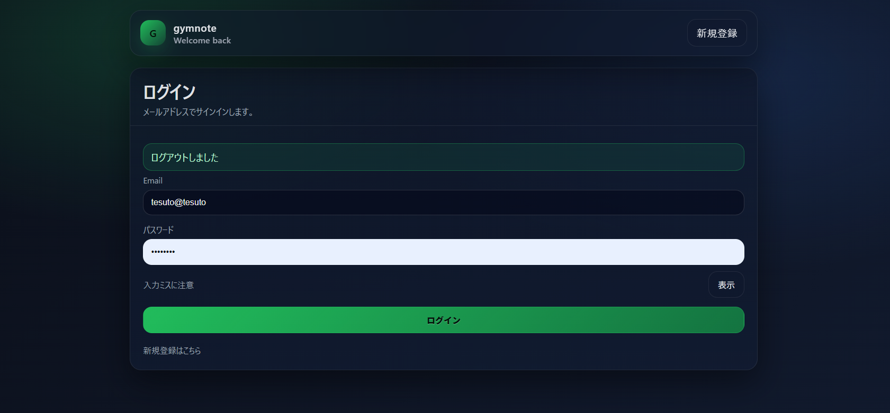
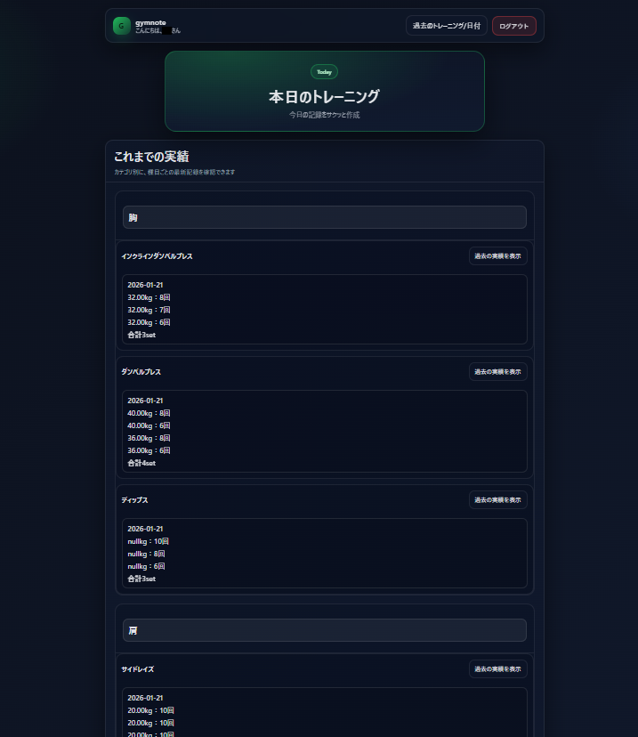
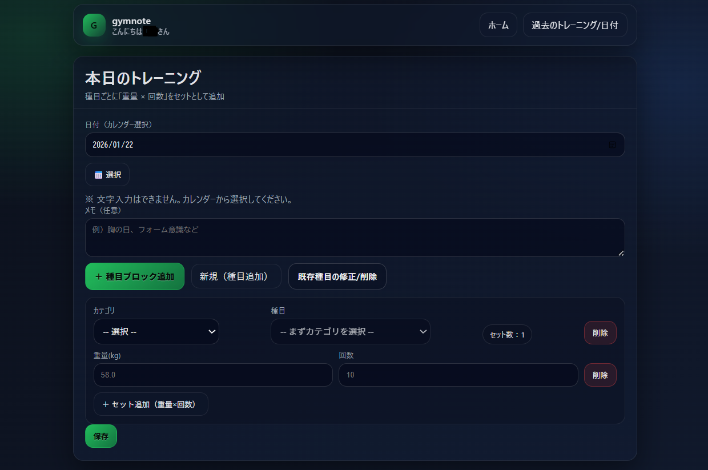
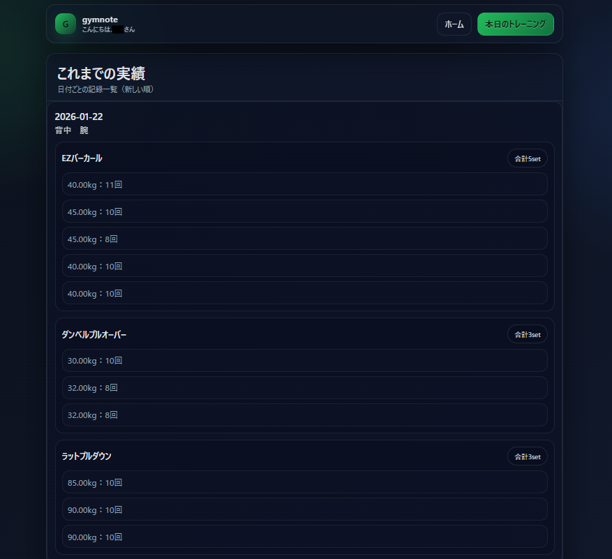

# 🏋️ Gymnote - 筋トレ記録 Web アプリケーション

## 概要

**Gymnote** は、日々のトレーニング内容を記録・可視化し、継続をサポートするためのWebアプリケーションです。  
**ユーザー認証機能**によって個人ごとに安全にデータを管理できるため、自分だけの成長記録を蓄積できます。

> ### 「継続力を、目に見えるカタチに」

---

## 主な機能

- ユーザー登録・ログイン（Spring Security）
- トレーニング記録の登録（部位・種目・セット数・重量 等）
- トレーニング履歴の一覧/詳細表示
- 種目（Exercise）の柔軟な管理機能
- 個人ごとのデータ分離とセキュア管理
- エラーページ（403 / 404 / 500）対応

---

## 📸 スクリーンショット

### ログイン


### トレーニング一覧


### トレーニング新規登録


### トレーニング編集


### 記録画面（詳細/記録）



## 使用技術・構成

### バックエンド

- Java 21
- Spring Boot 3.x
- Spring Security
- Spring Data JPA
- Maven

### フロントエンド

- Thymeleaf
- HTML5 / CSS3 / JavaScript

### データベース

- PostgreSQL
- Flyway（DBマイグレーション）

### 開発 & 運用

- WSL（Ubuntu）
- Git / GitHub
- VS Code

---

## ディレクトリ構成（抜粋）

```plaintext
src/
├── main/
│   ├── java/
│   │   └── com.example.gymnote/
│   │       ├── domain/
│   │       ├── repository/
│   │       ├── service/
│   │       ├── security/
│   │       └── web/
│   └── resources/
│       ├── templates/
│       ├── static/
│       └── application.yml
```

---

## セットアップ手順（ローカル開発用）

1. **リポジトリのクローン**

    ```bash
    git clone git@github.com:codeX42-R/gymnote.git
    cd gymnote
    ```

2. **環境変数の設定（`.env`ファイル作成）**

    プロジェクト直下に `.env` ファイルを作成し、下記を記述してください。

    ```
    DB_USER=your_db_user
    DB_PASS=your_db_password
    ```

    > ※ `.env` は `.gitignore` 対象です。

3. **データベース作成（PostgreSQL）**

    ```sql
    CREATE DATABASE gymnote;
    ```

4. **アプリケーションの起動**

    ```bash
    ./mvnw spring-boot:run
    ```

5. **アクセス**

    [http://localhost:8080](http://localhost:8080)

---

## アプリケーションの特徴・工夫

- Spring Securityによる認証/認可を実装
- パスワードはBCryptで安全にハッシュ化
- ログインユーザーごとにデータを厳密に分離
- ドメイン層ごとの明確な責務分割
- セキュリティ（CSRF対策/エラーハンドリング）徹底
- 実務的なGitブランチ/コミット運用方針

---

## 今後の展望

- トレーニング履歴のグラフ化・統計表示
- 種目のカスタム登録機能
- REST API 提供
- Dockerによる環境構築
- AWS/Render などクラウド環境へのデプロイ

---

## 作者

- **GitHub:** [codeX42-R](https://github.com/codeX42-R)
